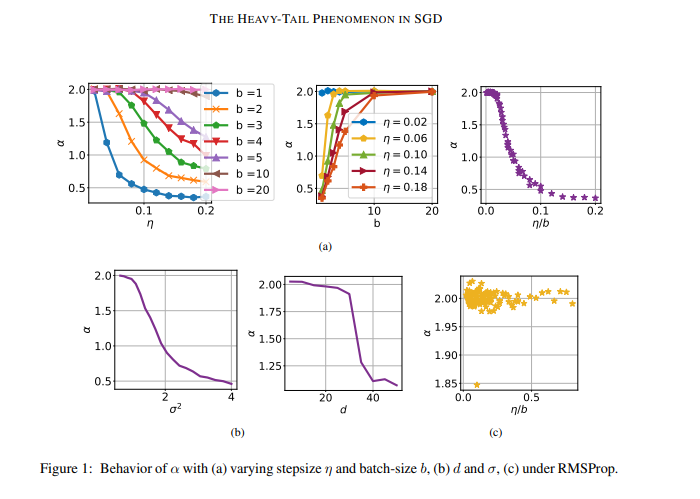
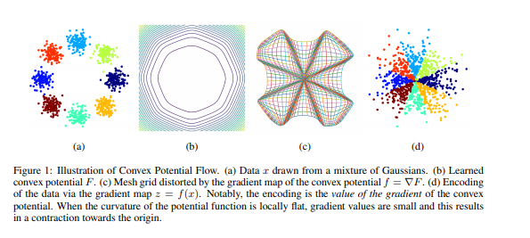

# Overview 

Papers divided by categories 

# 1. Training

## 1.1 SGD

[The Heavy-Tail Phenomenon in SGD](training/sgd/heavy_tail_phenomenon_sgd)

Tags: #theoretical_understanding

# 2. Models

## 2.1 Probabilistic Models

[Convex Potential Flows: Universal Probability Distributions with Optimal Transport and Convex Optimization](models/probabilistic_models/convex_potential_flow)

Tags: #model_improvement

# 3. Techniques 

## 3.1 Knowledge Distillation 

[A statistical perspective on distillation](techniques/distillation/why_distillation_helps_a_statistical_perspective)

