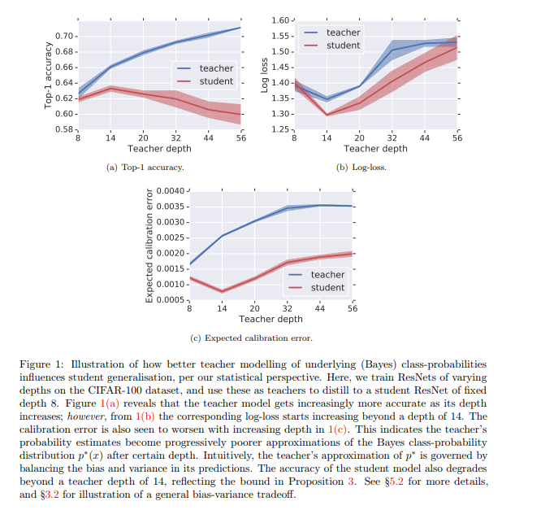

# Overview 

[Why distillation helps: a statistical perspective](https://arxiv.org/abs/2005.10419)

# TLDR 

TODO 

# Summary 

Understanding SGD 

# 1. Introduction 

- Setup Considered: Teacher - Student 

- Problem Considered: Classification

- Supervision Signal: from one-hot (provided by human) to distribution (provided by teacher)

# 2. Motivations 

Type: Improving the theoretical understanding of empirically observed good results 

Empirical Observation: Distillation Helps 

Theoretical Focus on: Why 

TODO 

