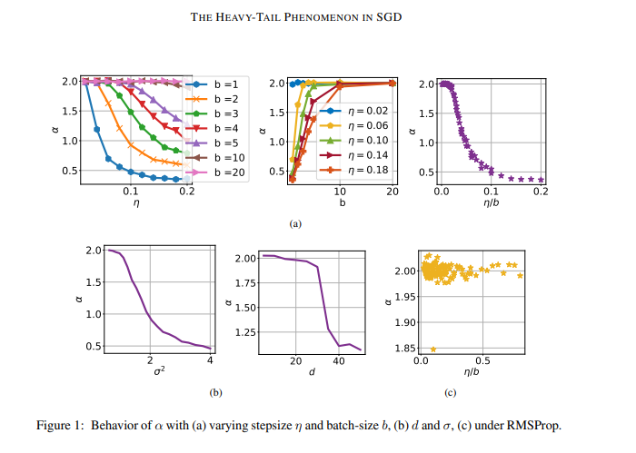

# Overview 

[The Heavy-Tail Phenomenon in SGD](https://arxiv.org/abs/2006.04740)

# TLDR 

TODO 

# Summary 

Understanding SGD 

# 1. Introduction 

SGD 

# 2. Motivations 

Type: Improving the theoretical understanding of empirically observed good results 

Empirical Observation: SGD is good at finding minima with good generalization capabilities (at the moment, it is at least better than other methods)

Theoretical Focus: Why 

TODO 

